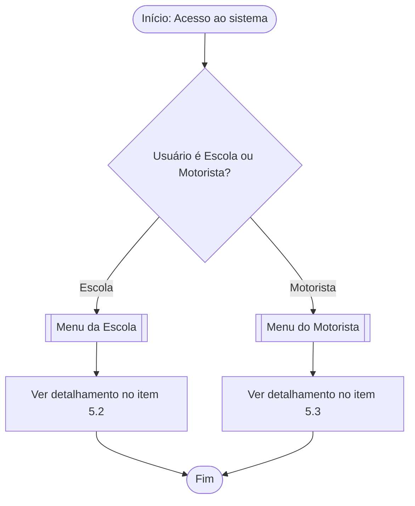
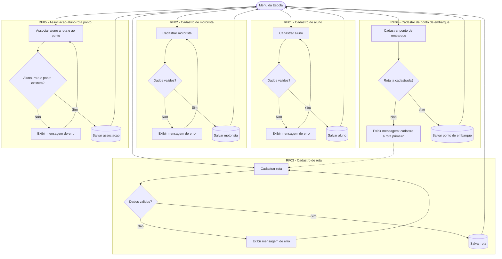
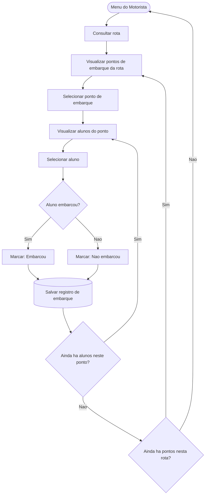
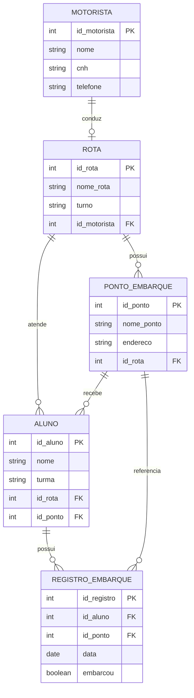

# Arquitetura do Sistema Rota Escolar

## 1. Visão geral

O **Rota Escolar** é um sistema pensado para auxiliar a escola na organização do transporte escolar. Ele permite que a escola cadastre alunos, motoristas, rotas e pontos de embarque, associando cada aluno a uma rota e a um ponto específico. Além disso, o sistema permite que o motorista consulte sua rota, visualize os alunos que devem embarcar em cada ponto e registre se o embarque ocorreu ou não. O objetivo principal é organizar as informações do transporte escolar de forma simples, centralizada e de fácil consulta.

Rastreabilidade e Gestão Ágil

* **Quadro Kanban no Trello:** [https://trello.com/b/aJmun5Bu/rota-escolar-projintegrador-ll]

---

## Matriz de Permissões (RBAC)

| Papel | Cadastrar Alunos/Motoristas | Criar Rotas e Pontos | Visualizar Rota e Alunos | Registrar Embarque |
| :--- | :---: | :---: | :---: | :---: |
| **Escola** | ✅ | ✅ | ✅ | ❌ |
| **Motorista** | ❌ | ❌ | ✅ | ✅ |

---

## Regras de Negócio e Segurança

* **Atribuição de Rota:** Cada motorista é associado a uma única rota por vez.
* **Vínculo do Aluno:** O aluno deve estar vinculado obrigatoriamente a uma Rota e a um Ponto de Embarque específico.
* **Restrição de Embarque:** Apenas o perfil Motorista possui permissão para registrar e salvar a presença/embarque dos alunos.
* **Simplicidade do Escopo:** O sistema foca estritamente na gestão do transporte escolar, sem integração de GPS ou sistemas externos.

## 2. Usuários do sistema

**Escola**
Responsável por toda a parte de cadastro e organização do sistema: cadastra alunos, motoristas, rotas e pontos de embarque, e realiza a associação dos alunos às rotas e pontos correspondentes.

**Motorista**
Responsável pela operação em campo: consulta a rota que lhe foi designada, visualiza os pontos de embarque e os alunos vinculados a cada ponto, e registra o embarque (ou não embarque) de cada aluno.

## 3. Requisitos funcionais

| Código | Descrição resumida |
|--------|---------------------|
| RF01 | Cadastro de alunos que utilizam o transporte escolar |
| RF02 | Cadastro dos motoristas responsáveis pelas escalas |
| RF03 | Cadastro e organização das rotas do transporte escolar |
| RF04 | Cadastro dos pontos de embarque de cada rota |
| RF05 | Associação de cada aluno a uma rota e a um ponto de embarque |
| RF06 | Consulta, pelo motorista, da sua rota e dos respectivos pontos de embarque |
| RF07 | Consulta, pelo motorista, dos alunos que devem embarcar em cada ponto |
| RF08 | Registro, pelo motorista, do embarque ou não embarque do aluno |

## 4. Requisitos não funcionais

| Código | Descrição resumida |
|--------|---------------------|
| RNF01 | O sistema deve possuir uma interface simples e fácil de usar |
| RNF02 | As informações de alunos, rotas e pontos de embarque devem ser apresentadas de forma organizada |

## 5. Fluxo principal

Para facilitar a leitura, o fluxo foi dividido em três partes: visão geral, detalhamento dos cadastros da Escola e detalhamento da operação do Motorista.

### 5.1 Visão geral

### 5.2 Fluxo da Escola - cadastros (RF01 a RF05)

### 5.3 Fluxo do Motorista - rota e embarque (RF06 a RF08)

### 5.4 Legenda dos símbolos

| Símbolo | Significado |
|---------|-------------|
| Oval | Início / Fim do fluxo |
| Retângulo duplo `[[ ]]` | Menu / tela principal |
| Retângulo simples | Ação ou etapa do processo |
| Losango `{ }` | Decisão (pergunta com Sim/Não) |
| Cilindro `[( )]` | Salvamento de dados |

## 6. Regras de negócio

- Todo aluno deve estar associado a uma rota.
- Todo aluno deve possuir um ponto de embarque vinculado.
- Cada ponto de embarque pertence a uma única rota, portanto a rota deve existir antes de cadastrar seus pontos.
- Um motorista pode ser responsável por, no máximo, uma rota.
- O motorista só pode consultar a rota à qual está associado.
- O motorista visualiza os alunos organizados por ponto de embarque.
- O motorista registra, para cada aluno, se houve embarque ou não embarque.
- Cada registro de embarque deve estar relacionado ao aluno e ao ponto/rota correspondente.

## 7. Modelo de dados

## 8. Entidades principais

**Aluno**
Representa o estudante que utiliza o transporte escolar. Está associado a uma rota e a um ponto de embarque específico.

**Motorista**
Representa o responsável por conduzir o veículo em uma rota. Cada motorista pode ser responsável por uma rota.

**Rota**
Representa o trajeto do transporte escolar. Uma rota pode conter vários pontos de embarque e vários alunos associados.

**Ponto de Embarque**
Representa o local onde os alunos aguardam o transporte. Cada ponto pertence a uma única rota e pode ter vários alunos vinculados.

**Registro de Embarque**
Representa o registro diário informando se um aluno embarcou ou não em determinado ponto de embarque.

## 9. Protótipo das telas

- Tela de acesso
- Menu principal (com diferenciação entre Escola e Motorista)
- Cadastro de alunos
- Cadastro de motoristas
- Rotas e pontos de embarque
- Alunos por ponto
- Registro de embarque
